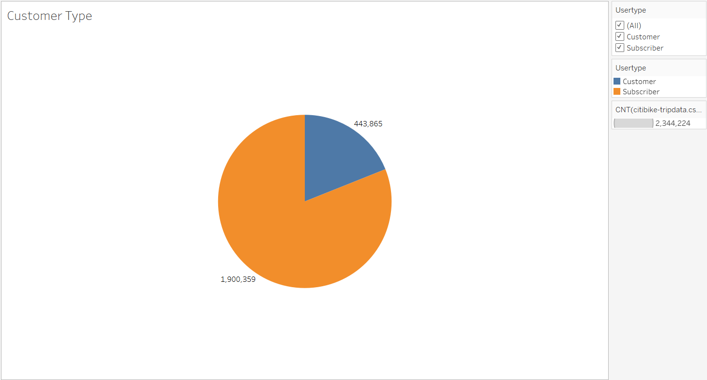
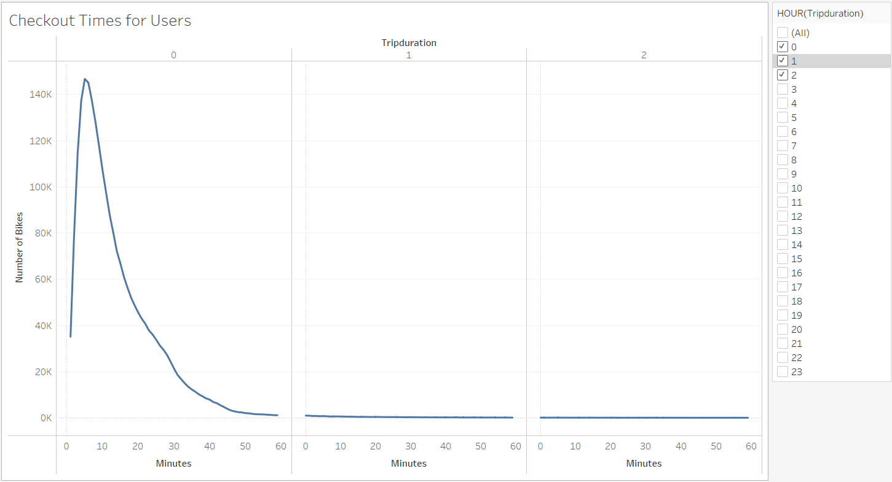
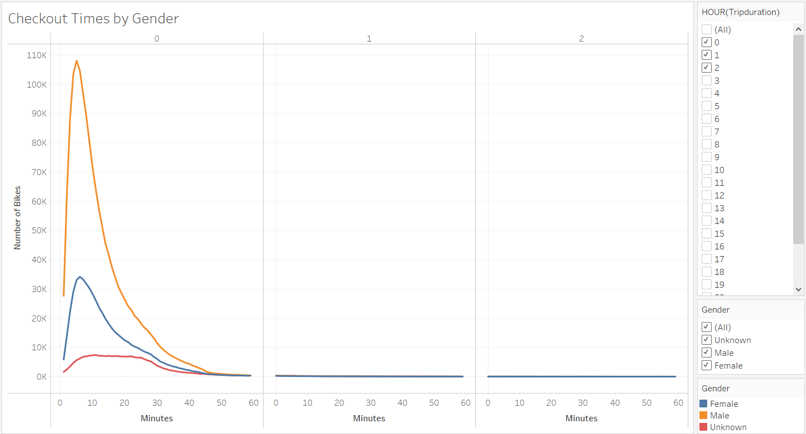
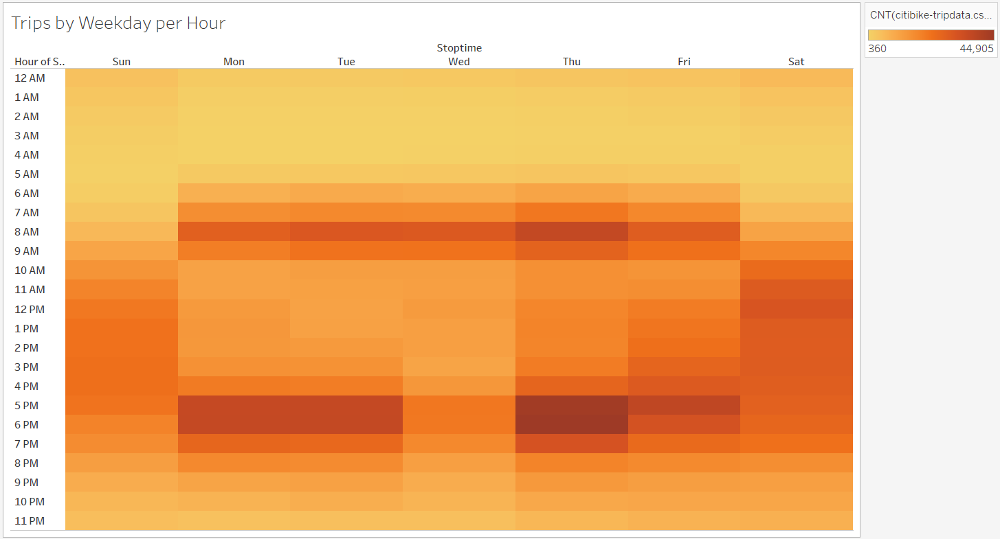
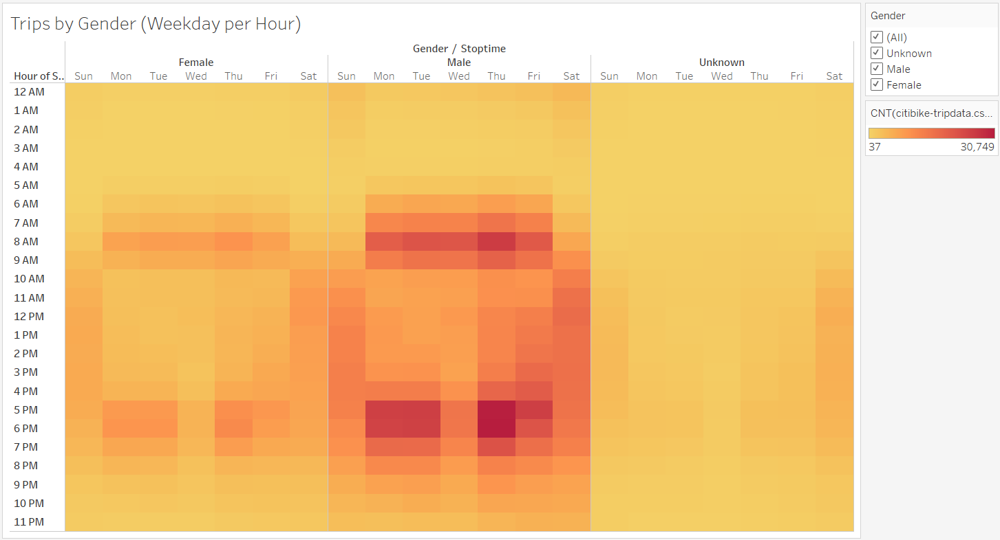
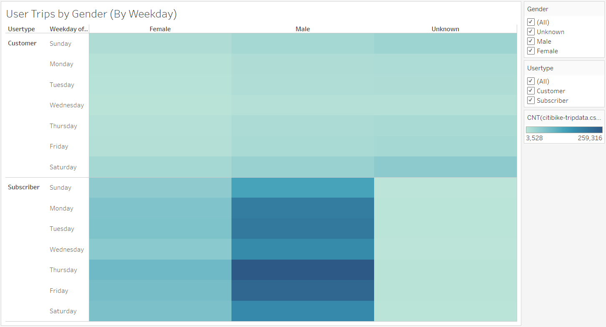
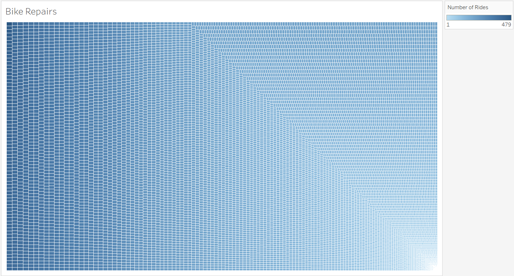

# Bikesharing Analysis

## Overview of Project

#### Prompt: Now that we've gotten a good idea of how to create our story, there is still some more work to be done to convince investors that a bike-sharing program in Des Moines is a solid business proposal. To solidify the proposal, one of the key stakeholders would like to see a bike trip analysis.

## Results
* 

###

* 

* 

* 

* 

* 

* 

* 

## Summary
* 
